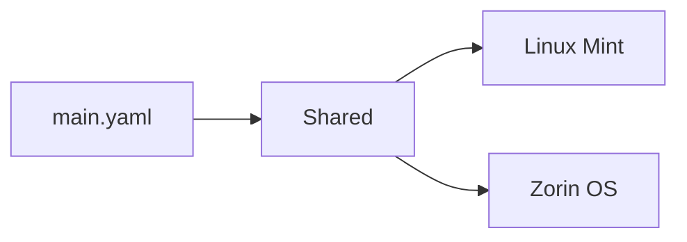

# Ansible role for your DevOps/SysOps Linux Mint 22.x/Zorin OS based workstation

[](https://github.com/marcinbojko/pld/actions/workflows/01_lint_me.yml)
[](https://github.com/marcinbojko/pld/actions/workflows/02_ansible_lint.yml)

<!-- TOC -->

- [Ansible role for your DevOps/SysOps Linux Mint 22.x/Zorin OS based workstation](#ansible-role-for-your-devopssysops-linux-mint-22xzorin-os-based-workstation)
  - [Description](#description)
  - [Prerequisites](#prerequisites)
  - [Ansible 2.10 and higher reminder](#ansible-210-and-higher-reminder)
  - [Assumptions](#assumptions)
  - [In-place upgraded OS warning](#in-place-upgraded-os-warning)
    - [Python2 removal](#python2-removal)
  - [Usage](#usage)
  - [Variables](#variables)
    - [Variables from roles/pld/defaults/main.yml](#variables-from-rolesplddefaultsmainyml)
    - [OS specific variables](#os-specific-variables)
      - [Shared variables](#shared-variables)
      - [Variables for Linux Mint 21.x](#variables-for-linux-mint-21x)
      - [Variables for Zorin OS 17.x](#variables-for-zorin-os-17x)
    - [Variables precedence](#variables-precedence)
  - [Custom variables, custom variable files](#custom-variables-custom-variable-files)
  - [Repositories](#repositories)
    - [Repositories: Basic](#repositories-basic)
    - [Repositories: Optional](#repositories-optional)
  - [Packages](#packages)
    - [Packages: Essential](#packages-essential)
    - [Packages: Basic not complete list](#packages-basic-not-complete-list)
    - [Packages: Optional not complete list](#packages-optional-not-complete-list)
    - [Packages: Flatpak](#packages-flatpak)
    - [Packages: npm](#packages-npm)
  - [Tasks](#tasks)
    - ['configure_neofetch task](#configure_neofetch-task)
  - [Startup applications](#startup-applications)
    - [OS Tweaks](#os-tweaks)
  - [Q&A](#qa)
  - [To Do](#to-do)
  - [Known issues](#known-issues)

<!-- /TOC -->

## Description

This role is designed to configure your Linux Mint 22.x or Zorin OS 17.x workstation. It will install essential packages, main packages, extra/optional packages, 3rd party software, and configure your system. It will also install extra binaries in `/usr/local/bin` folder.

It will also change startup settings for a specific user (that's why you should not run this as root). It will also change `ansible.cfg`, `dconf` settings, and `sysctl` system settings.

It's an extension od my previous project - [https://github.com/marcinbojko/linux_mint](https://github.com/marcinbojko/linux_mint) which won't be updated anymore.

## Prerequisites

- installed `Linux Mint` 22.x - all 64-bit, standard options with extra codecs (available as selection during install)
- installed `Zorin OS` 17.x - all 64-bit, standard options with extra codecs (available as selection during install)
- access to internet
- `openssh-server` installed and running
- `ansible` in version 2.10 or higher
- `sudo ansible-galaxy install -r requirements.yml`

  ```bash
  sudo apt install openssh-server;sudo systemctl enable ssh && sudo systemctl start ssh
  ```

- PermitRootLogin in `/etc/ssh/sshd_config` if you're using root account

## Ansible 2.10 and higher reminder

- `sudo ansible-galaxy install -r requirements.yml  --roles-path /etc/ansible/roles`

## Assumptions

- 10 GB free space on OS drive (recommended 20-30 due to Flatpak)
- ssh private key or password method
- user specified in `group_vars` or passed in variable `ansible_ssh_user`
- by default, extra binaries (outside packages) will be installed in `/usr/local/bin` (adjustable by `pld_bin_path` variable) If you prefer to keep them in cloud (sync between computers), down below I'll attach info how to replace binaries with proper -ymlinks (work in progress)
- adds repositories with codename and filename
- adds missing pgp keys for repositories
- installs essential packages
- installs main packages
- installs extra/optional packages
- downloads 3rd party software and puts it in proper path - `/usr/local/bin` by default (adjustable by `pld_bin_path` variable)
- changes startup settings for specific user (that's why you should not run this as root)
- changes in `ansible.cfg`
- changes in `dconf` settings
- changes in `sysctl` system settings

## In-place upgraded OS warning

Role of this playbook is to work on clean or cleanly-upgraded system. I haven't tested it properly in case of in-place upgrade systems, so both 18=>19 and 19=>20 upgrades and playbook usage, are risky and experimental. Make sure all apt repositories (except system ones) are removed from /etc/apt - playbook works best when this list is empty.

Warning - systems after upgrade will require: `ansible_python_interpreter=/usr/bin/python3` setting.

### Python2 removal

Be aware several packages (virtualbox-6.1, zenmap) will install python2 and remove python-is-python3 package.

```bash
sudo apt update
sudo apt install python-is-python3
sudo apt update
sudo apt remove python2 --simulate
sudo apt remove python2
```

## Usage

```bash
ansible-playbook ./pld.yaml -i myhost.lst
```

or change user you're using (startup related stuff will be done for that specific user user)

```bash
ansible-playbook ./pld.yaml -i myhost.lst --extra-vars "pld_active_user=myuser"
```

in case you'd like to run as root with password or ssh key, you can do desktop related changes for user bob

```bash
ansible-playbook ./pld.yaml -i myhost.lst --extra-vars "pld_active_user=bob"
```

or passing true/false as JSON

```bash
ansible-playbook ./pld.yaml -i myhost.lst --extra-vars '{"install_optional": "true"}'
```

or passing several variables as variables.yaml file

```bash
ansible-playbook ./pld.yaml -i myhost.lst --extra-vars @variables.yaml
```

## Variables

Variables are separated into multiple sets of files.

### Variables from `roles/pld/defaults/main.yml`

Variables for controlling playbook behavior

| Variable                      | Value                    | Comment                                                                 |
| ----------------------------- | ------------------------ | ----------------------------------------------------------------------- |
| pld_active_user               | "{{ ansible_ssh_user }}" | User for which you're setting folders. By default taken from group_vars |
| pld_bin_path                  | /usr/local/bin           | Where to put all downloaded execs                                       |
| pld_config_ansible            | true                     | Change ansible settings in ansible.cfg                                  |
| pld_config_autostart          | true                     | Change application autostart settings                                   |
| pld_config_dconf              | true                     | Change dconf settings                                                   |
| pld_config_neofetch           | true                     | Change neofetch settings                                                |
| pld_config_sysctl             | true                     | Change sysctl settings                                                  |
| pld_delay_time                | 1                        | Delay time in seconds between retries                                   |
| pld_install_deb               | true                     | Should extra deb packages be installed                                  |
| pld_install_flatpak           | true                     | Should flatpak packages be installed                                    |
| pld_install_npm               | true                     | Should npm packages be installed                                        |
| pld_install_optional          | true                     | Should optional packages be installed                                   |
| pld_install_state             | latest                   | If set to latest, every pass of playbook will also update packages      |
| pld_install_steampipe_plugins | true                     | Should we install extra steampipe plugins                               |
| pld_install_vscode_extensions | true                     | Should we install extra vscode extensions                               |
| pld_install_yubico            | false                    | Should we install yubico software                                       |
| pld_install_zsh               | true                     | Should we install oh-my-zsh and p10k theme                              |
| pld_reboot_required           | false                    | Force reboot even if apt upgrade won't change anything                  |
| pld_remove_flatpak            | true                     | Should flatpak packages be removed                                      |
| pld_retries_count             | 1                        | How many retries                                                        |
| pld_unpack_folder             | /tmp/linux_mint          | Which folder to use when downloading and unarchiving                    |

### OS specific variables

Most OS variables are stored in `roles/pld/vars/*.yml` files.

#### Shared variables

Are located in file `roles/pld/vars/shared.yml`

| Variable                   | Description                                              |
| -------------------------- | -------------------------------------------------------- |
| ansible_python_interpreter | Specifies the Python interpreter path for Ansible        |
| pld_alternatives           | List of alternatives to set                              |
| pld_ansible                | List of Ansible roles to install                         |
| pld_codename               | Codename for the Linux Mint or Zorin OS version          |
| pld_deb                    | List of deb packages to install                          |
| pld_deb822_repositories    | List of deb822 repositories to add                       |
| pld_downloads              | List of URLs to download files from                      |
| pld_files                  | List of files to copy                                    |
| pld_files_remove           | List of files to remove                                  |
| pld_files_remove_bin_path  | Path to remove files from                                |
| pld_flatpak                | List of Flatpak packages to install                      |
| pld_flatpak_remove         | List of Flatpak packages to remove                       |
| pld_global_env             | List of global environment variables to set              |
| pld_keys                   | List of GPG keys to import                               |
| pld_keys_keyserver         | Keyserver to use for importing GPG keys                  |
| pld_keys_remove            | List of GPG keys to remove                               |
| pld_neofetch               | Whether to configure Neofetch                            |
| pld_npm                    | List of npm packages to install                          |
| pld_packages               | List of packages to install                              |
| pld_packages_clean_system  | Whether to clean the system before installing packages   |
| pld_packages_optional      | List of optional packages to install                     |
| pld_packages_remove        | List of packages to remove                               |
| pld_pip                    | List of Python packages to install with pip              |
| pld_pip_executable         | Path to the pip executable                               |
| pld_repositories_remove    | List of repositories to remove                           |
| pld_services               | List of services to enable or disable                    |
| pld_startup_template       | Path to the startup template file                        |
| pld_steampipe              | List of Steampipe plugins to install                     |
| pld_sysctl                 | List of sysctl settings to apply                         |
| pld_timezone               | Timezone to set                                          |
| pld_unpack                 | List of archives to unpack                               |
| pld_vscode                 | List of Visual Studio Code extensions to install         |
| pld_vscode_obsolete        | List of obsolete Visual Studio Code extensions to remove |
| pld_yubico_flatpak         | List of Yubico Flatpak packages to install               |
| pld_yubico_packages        | List of Yubico packages to install                       |
| pld_yubico_repo_key        | GPG key for Yubico repository                            |
| pld_yubico_repositories    | List of Yubico repositories to add                       |

#### Variables for `Linux Mint 21.x`

Are located in file `roles/pld/vars/Linux Mint.yml`

| Variable | Description |
|\_---------------------------------|--------------------------------------------------|
| pld_deb822_repositories_optional | Optional deb822 repositories to add for Mint |
| pld_packages_essential | Essential packages to install |
| pld_startup | Startup settings for specific user |
| pld_dconf | Dconf settings |

#### Variables for `Zorin OS 17.x`

Are located in file `roles/pld/vars/Zorin OS.yml`

| Variable | Description |
|\_---------------------------------|--------------------------------------------------|
| pld_deb822_repositories_optional | Optional deb822 repositories to add for Zorin |
| pld_packages_essential | Essential packages to install |
| pld_startup | Startup settings for specific user |
| pld_dconf | Dconf settings |

### Variables precedence



## Custom variables, custom variable files

TBD

<!-- ## Custom variables, custom variable files

If you don't want to track changes or change main variable file content with every pull, create your own custom variable files. By default playbook will look for files: `mint[ansible_distribution_major_version]*.yaml`
This means - if your distro is `Linux Mint 20`, place a file in a playbook folder witha name: `mint20_custom.yaml`
If your distro is `Linux Mint 21`, place a file in a playbook folder with a name: `mint21_custom.yaml`
These filters are added to .gitignore to not override your changes
Be careful not to add multiple matching files with corresponding names

### Custom file content

```yaml
custom_repositories: []
custom_keys: []
custom_packages: []
```

### Custom file example

`mint20_custom.yaml`

```yaml
custom_repositories:
  # Example
  # - name: google-cloud-sdk
  #   types: deb
  #   suites: cloud-sdk
  #   components: main
  #   uris:
  #     - "https://packages.cloud.google.com/apt"
  #   enabled: true
  #   architectures: amd64
  #   signed_by: https://packages.cloud.google.com/apt/doc/apt-key.gpg
custom_keys:
- https://somekeyfile/key.pgp
custom_packages:
- vlc
``` -->

## Repositories

### Repositories: Basic

- `alexx2000` - Double Commander
- `ansible` - Ansible
- `azure-cli` - Azure CLI SDK
- `docker-stable` - Docker-CE
- `gcsfuse` - Google Storage gcsfuse - Mount a GCS bucket locally`
- `google-cloud-sdk` - Google Cloud Tools SDK
- `googlechrome` - Google Chrome Browser
- `hashicorp` - Hashicorp tools
- `helm-stable-debian` - Helm for Kubernetes
- `kubernetes-129` - Google Kubernetes kubeadm & kubectl for 1.29
- `microsoft-prod-deb` - Microsoft .Net Core
- `mozilla-team` - Stable Firefox and Mozilla Software
- `nodesource20` - Node.js LTS
- `palemoon` - Chromium based Java+Flash browser
- `ubuntu-mozilla-security` - Firefox and Thunderbird Security
- `virtualbox` - Virtualization Software
- `vscode` - Microsoft Visual Studio Code

### Repositories: Optional

- `dockbarx` - DockBarX is a lightweight taskbar
- `grub-customizer` - customize black screen to something useful
- `insync` - Googledrive & Onedrive Linux Client
- `lens` - Kubernetes IDE
- `ngrok` - Secure tunnels to localhost
- `noobslab-icons` - Noobslab icons
- `rancher-desktop` - Rancher Desktop
- `trivy` - Container security scanner
- `veeam-agent` - Veeam Agent for Linux
- `veracrypt` - Device encryption utility

## Packages

### Packages: Essential

### Packages: Basic (not complete list)

| Software               | Type                                                                               | Link                                                                                                                                                 |
| ---------------------- | ---------------------------------------------------------------------------------- | ---------------------------------------------------------------------------------------------------------------------------------------------------- |
| Amass                  | In-depth Attack Surface Mapping and Asset Discovery                                | [https://github.com/OWASP/Amass](https://github.com/OWASP/Amass)                                                                                     |
| AngryIP Scanner        | Network Scanner                                                                    | [https://angryip.org/](https://angryip.org/)                                                                                                         |
| Azure CLI              | Command-line tools for Azure                                                       | [https://github.com/Azure/azure-cli](https://github.com/Azure/azure-cli)                                                                             |
| Balena-etcher          | Image Writer                                                                       | [https://www.balena.io/etcher/](https://www.balena.io/etcher/)                                                                                       |
| Ctop                   | Container process monitor                                                          | [https://github.com/bcicen/ctop](https://github.com/bcicen/ctop)                                                                                     |
| Diodon                 | Clipboard Manager                                                                  | [https://launchpad.net/diodon](https://launchpad.net/diodon)                                                                                         |
| Dive                   | Docker image explorer                                                              | [https://github.com/wagoodman/dive](https://github.com/wagoodman/dive)                                                                               |
| Dockle                 | Container Image Linter for Security                                                | [https://github.com/goodwithtech/dockle](https://github.com/goodwithtech/dockle)                                                                     |
| Double Commander       | File Manager                                                                       | [https://doublecmd.sourceforge.io/](https://doublecmd.sourceforge.io/)                                                                               |
| Ffuf                   | Fast web fuzzer written in Go                                                      | [https://github.com/ffuf/ffuf](https://github.com/ffuf/ffuf)                                                                                         |
| GitKraken              | Git Client                                                                         | [https://www.gitkraken.com/](https://www.gitkraken.com/)                                                                                             |
| Google Chrome          | Browser                                                                            | [https://www.google.com/intl/pl_ALL/chrome/](https://www.google.com/intl/pl_ALL/chrome/)                                                             |
| Google Cloud SDK       | Command-line tools for GCP                                                         | [https://cloud.google.com/sdk](https://cloud.google.com/sdk)                                                                                         |
| Google Kubectl/Kubeadm | Kubernetes Manager                                                                 | [https://kubernetes.io/docs/reference/kubectl/overview/](https://kubernetes.io/docs/reference/kubectl/overview/)                                     |
| Gping                  | Ping with a graph                                                                  | [https://github.com/orf/gping](https://github.com/orf/gping)                                                                                         |
| Hadolint               | Docker linter                                                                      | [https://github.com/hadolint/hadolint](https://github.com/hadolint/hadolint)                                                                         |
| Helm                   | Package manager for Kubernetes                                                     | [https://helm.sh/](https://helm.sh/)                                                                                                                 |
| k3d                    | k3d creates containerized k3s clusters                                             | [https://k3d.io/](https://k3d.io/)                                                                                                                   |
| k3s                    | Lightweight Kubernetes 5 less than k8s                                             | [https://k3s.io/](https://k3s.io/)                                                                                                                   |
| k9s                    | Kubernetes CLI Manager                                                             | [https://github.com/derailed/k9s](https://github.com/derailed/k9s)                                                                                   |
| Keepass                | Password Manager                                                                   | [https://keepass.info/](https://keepass.info/)                                                                                                       |
| Kubeconform            | Kubernetes config validator                                                        | [https://github.com/yannh/kubeconform](https://github.com/yannh/kubeconform)                                                                         |
| Kubent                 | Kubernetes-no-trouble                                                              | [https://github.com/doitintl/kube-no-trouble](https://github.com/doitintl/kube-no-trouble)                                                           |
| Kubernetes             | Production-Grade Container Orchestration                                           | [https://kubernetes.io/](https://kubernetes.io/)                                                                                                     |
| Kustomize              | Kubernetes customiser                                                              | [https://github.com/kubernetes-sigs/kustomize](https://github.com/kubernetes-sigs/kustomize)                                                         |
| Lens                   | Kubernetes IDE                                                                     | [https://k8slens.dev/](https://k8slens.dev/)                                                                                                         |
| Minikube               | Run Kubernetes locally                                                             | [https://github.com/kubernetes/minikube](https://github.com/kubernetes/minikube)                                                                     |
| Packer                 | Image creator                                                                      | [https://www.packer.io/](https://www.packer.io/)                                                                                                     |
| Packetsender           | Packet Sender can send and receive UDP, TCP, and SSL on the ports of your choosing | [https://packetsender.com/](https://packetsender.com/)                                                                                               |
| Palemoon               | Browser alternative (Java\_+Flash)                                                 | [https://www.palemoon.org/](https://www.palemoon.org/)                                                                                               |
| Polaris                | Validation of best practices in your Kubernetes clusters                           | [https://www.fairwinds.com/polaris](https://www.fairwinds.com/polaris)                                                                               |
| RamboxOS               | Multi IM                                                                           | [https://github.com/TheGoddessInari/hamsket](https://github.com/TheGoddessInari/hamsket)                                                             |
| Rancher Desktop        | Rancher Desktop runs Kubernetes and container management on your desktop           | [https://rancherdesktop.io/](https://rancherdesktop.io/)                                                                                             |
| Redshift               | Monitor temperature changer                                                        | [http://jonls.dk/redshift/](http://jonls.dk/redshift/)                                                                                               |
| Remmina                | Remote Connection Manager                                                          | [https://remmina.org/](https://remmina.org/)                                                                                                         |
| Shutter                | Screenshot Manipulation                                                            | [http://shutter-project.org/](http://shutter-project.org/)                                                                                           |
| Sops                   | Secrets manager                                                                    | [https://github.com/getsops/sops](https://github.com/getsops/sops)                                                                                   |
| Synapse                | Symantic Launcher                                                                  | [https://launchpad.net/synapse-project](https://launchpad.net/synapse-project)                                                                       |
| Tabby                  | Modern Terminal                                                                    | [https://github.com/Eugeny/terminus](https://github.com/Eugeny/terminus)                                                                             |
| Teller                 | Secret manager                                                                     | [https://github.com/tellerops/teller](https://github.com/tellerops/teller)                                                                           |
| Terraform              | Infrastructure as Code                                                             | [https://www.terraform.io/](https://www.terraform.io/)                                                                                               |
| Vagrant                | Unified Workflow                                                                   | [https://www.vagrantup.com/](https://www.vagrantup.com/)                                                                                             |
| Vault                  | Secrets Manager                                                                    | [https://www.vaultproject.io/](https://www.vaultproject.io/)                                                                                         |
| VirtualBox             | Virtualization                                                                     | [https://www.virtualbox.org/](https://www.virtualbox.org/)                                                                                           |
| Visual Studio Code     | Code editor                                                                        | [https://code.visualstudio.com/](https://code.visualstudio.com/)                                                                                     |
| WPS Office for Linux   | Productivity Tools                                                                 | [https://www.wps.com/wps-office-for-linux/](https://www.wps.com/wps-office-for-linux/)                                                               |
| XCA                    | Certificate Manager                                                                | [https://hohnstaedt.de/xca/](https://hohnstaedt.de/xca/)                                                                                             |
| Yq                     | YAML processor                                                                     | [https://github.com/mikefarah/yq/releases/download/v4.43.1/yq_linux_amd64](https://github.com/mikefarah/yq/releases/download/v4.43.1/yq_linux_amd64) |
|                        |                                                                                    |                                                                                                                                                      |

### Packages: Optional (not complete list)

| Software              | Type                                                                             | Link                                                   |
| --------------------- | -------------------------------------------------------------------------------- | ------------------------------------------------------ |
| Brave Browser         | Browser alternative                                                              | [Brave](https://brave.com/)                            |
| DockbarX              | Panel                                                                            | [DockbarX](https://github.com/M7S/dockbarx)            |
| Enpass                | Password manager                                                                 | [Enpass](https://www.enpass.io/)                       |
| GIMP                  | GNU Image Manipulation Program                                                   | [GIMP](https://www.gimp.org/)                          |
| Insync                | Googledrive & Onedrive linux client                                              | [Insync](https://www.insynchq.com/)                    |
| Kodi                  | Open Source Home Theater                                                         | [Kodi](https://kodi.tv/)                               |
| Neofetch              | A command-line system information tool written in bash 3.2+                      | [Neofetch](https://github.com/dylanaraps/neofetch)     |
| Pinta                 | Drawing/Image Editing                                                            | [Pinta](https://pinta-project.com/pintaproject/pinta/) |
| Spotify               | Music Player                                                                     | [Spotify](https://www.spotify.com/pl/download/linux/)  |
| Steampipe             | select \* from cloud                                                             | [Steampipe](https://steampipe.io/)                     |
| Sublime Text 3        | Text Editor                                                                      | [Sublime Text](https://www.sublimetext.com/3)          |
| Betterbird            | Email client                                                                     | [Betterbird](https://www.betterbird.eu/)               |
| Trivy                 | A Simple and Comprehensive Vulnerability Scanner for Containers, Suitable for CI | [Trivy](https://github.com/aquasecurity/trivy)         |
| Veeam Agent for Linux | Backup tool                                                                      | [Veeam](https://www.veeam.com)                         |
| Veracrypt             | Source disk encryption                                                           | [Veracrypt](https://www.veracrypt.fr/en/Home.html)     |

||||

### Packages: Flatpak

| Software            | Type                      | Link                                                                       |
| ------------------- | ------------------------- | -------------------------------------------------------------------------- |
| Bitwarden           | Password Manager          | [Bitwarden](https://bitwarden.com/%29)                                     |
| Boxes               | Virtualization            | [Boxes](https://wiki.gnome.org/Apps/Boxes%29)                              |
| Brave               | Web Browser               | [Brave](https://brave.com/%29)                                             |
| EasyEffects         | Audio Effects Tool        | [EasyEffects](https://github.com/wwmm/easyeffects%29)                      |
| Enpass              | Password Manager          | [Enpass](https://www.enpass.io/%29)                                        |
| Firefox             | Web Browser               | [Firefox](https://www.mozilla.org/en-US/firefox/new/%29)                   |
| Flatseal            | Permissions Manager       | [Flatseal](https://flathub.org/apps/details/com.github.tchx84.Flatseal%29) |
| FreeFileSync        | File Synchronization      | [FreeFileSync](https://freefilesync.org/%29)                               |
| GIMP                | Image Editor              | GIMP                                                                       |
| Headlamp            | Kubernetes Dashboard      | [Headlamp](https://kinvolk.io/headlamp/%29)                                |
| Kdenlive            | Video Editor              | [Kdenlive](https://kdenlive.org/%29)                                       |
| Kodi                | Media Center              | [Kodi](https://kodi.tv/%29)                                                |
| Krita               | Digital Painting          | [Krita](https://krita.org/%29)                                             |
| LibreOffice         | Office Suite              | [LibreOffice](https://www.libreoffice.org/%29)                             |
| MissionCenter       | Project Management        | [MissionCenter](https://missioncenter.io/%29)                              |
| Obsidian            | Note-taking App           | [Obsidian](https://obsidian.md/%29)                                        |
| Pinta               | Image Editor              | [Pinta](https://pinta-project.com/%29)                                     |
| Raspberry Pi Imager | Raspberry Pi Image Writer | [Raspberry Pi Imager](https://www.raspberrypi.org/software/%29)            |
| Remmina             | Remote Desktop Client     | [Remmina](https://remmina.org/%29)                                         |
| Spotify             | Music Streaming           | [Spotify](https://www.spotify.com/%29)                                     |
| Sublime Text        | Text Editor               | [Sublime Text](https://www.sublimetext.com/%29)                            |
| VLC                 | Media Player              | [VLC](https://www.videolan.org/vlc/%29)                                    |
| Vivaldi             | Web Browser               | [Vivaldi](https://vivaldi.com/%29)                                         |
| WPS Office          | Office Suite              | [WPS Office](https://www.wps.com/%29)                                      |
| Zenmap              | Network Scanner           | [Zenmap](https://nmap.org/zenmap/%29)                                      |
| Zoom                | Video Conferencing        | [Zoom](https://zoom.us/%29)                                                |

### Packages: npm

| Software       | Type              | Link                                                                                             |
| -------------- | ----------------- | ------------------------------------------------------------------------------------------------ |
| Dockerfilelint | Dockerfile linter | [https://github.com/replicatedhq/dockerfilelint](https://github.com/replicatedhq/dockerfilelint) |
|                |                   |                                                                                                  |

## Tasks

| Task                    | Description                                                                      | Link                                                                                                                                                          |
| ----------------------- | -------------------------------------------------------------------------------- | ------------------------------------------------------------------------------------------------------------------------------------------------------------- |
| install_yubico_software | Install keys, repositories, packages and dekstop files for Yubico infrastructure | [https://yubico.com](https://yubico.com)                                                                                                                      |
| configure_zsh           | Installs files required by zsh, `oh-my-zsh` and `powerlevel10k`                  | [https://github.com/ohmyzsh/ohmyzsh](https://github.com/ohmyzsh/ohmyzsh) [https://github.com/romkatv/powerlevel10k](https://github.com/romkatv/powerlevel10k) |
| steampipe_plugins.yaml  | Install steampipe plugins                                                        | [https://steampipe.io/](https://steampipe.io/)                                                                                                                |
| configure_neofetch      | Installs and configures neofetch                                                 | [https://github.com/dylanaraps/neofetch](https://github.com/dylanaraps/neofetch)                                                                              |
|                         |                                                                                  |                                                                                                                                                               |

### 'configure_neofetch` task

This guide details the automation of Neofetch configuration adjustments using an Ansible playbook. By specifying various tasks in the playbook, users can easily comment out or uncomment specific lines within the Neofetch configuration file, toggle key-value pairs between "on" and "off", and ensure the creation of the Neofetch configuration file if it doesn't exist.
Furthermore, it includes adding Neofetch to the global bashrc file for automatic execution.

The playbook operates based on a defined payload structure within a YAML file. Here's an example of the payload configuration for the Neofetch automation task:

```yaml
neofetch:
  config_path: /home/{{ pld_active_user }}/.config/neofetch/config.conf
  remove_lines:
    - Packages
    - Resolution
    - DE
    - WM
    - WM Theme
    - Theme
    - Icons
    - Terminal
    - Terminal Font
    - cols
  add_lines:
    - Disk
    - Local IP
  toggle_items:
    - key: "color_blocks"
      value: "off"
```

Explanation of Configuration Parameters:

- `config_path`: Specifies the path to the Neofetch configuration file. This path can be dynamically set to match the active user's home directory.

  ```yaml
  config_path: /home/{{ pld_active_user }}/.config/neofetch/config.conf
  ```

- `remove_lines`: A list of items to be commented out in the Neofetch configuration file. This list should contain the titles of the information blocks as they appear in the configuration.

  ```yaml
  remove_lines:
    - Packages
    - Resolution
  ```

- `add_lines`: Similar to remove_lines, but these items will be uncommented if they were previously commented out, ensuring they are active in the Neofetch output.

  ```yaml
  add_lines:
    - Disk
    - Local IP
  ```

- `toggle_items`: This section allows for toggling specific key-value pairs within the configuration file. For example, changing color_blocks from "on" to "off" or vice versa.

  ```yaml
  toggle_items:
    - key: "color_blocks"
      value: "off"
  ```

## Startup applications

Some applications are copied to `autostart` folder

- Diodon
- DockbarX
- Synapse
- Shutter

### OS Tweaks

- changes timezone and ntpd settings
- modifies `sysctl` settings to start use `tcp_congestion_control` set to `bbr`
- modifies `sysctl` settings to decrease default swappiness
- changes `alternatives` for EDITOR
- initial `Timeshift` launch
- change fstrim schedule to `hourly`
- installs popular Microsoft Visual Studio Code extensions
- change `dconf` settings

## Q&A

- Q: Will it work with specific version WSL/Ubuntu/PidgeonOS?
- A: Don't know, don't care. Do your own variables.yml and check

- Q: What will happen if I'll run it multiple times?
- A: I hope - your applications will be upgraded, same for repos and keys. But, due to DEB/APT dependency you have to look for possible `downgrade` related errors. See `Known Issues` for it.

- Q: Can i check this in Ubuntu
- A: Yes, but be prepared to create your own `variables.yml` and pass it as a parameter

- Q: Can I participate?
- A: Yes, but please create your own branch and do PR. Do not merge to master. Please keep master branch clean.

- Q: I don't know how to do the above
- A: Then don't do it ;)

- Q: Why there is so many Ubuntu:Bionic/Xenial, not so many LinuxMint:Tara repositories?
- A: Tara is built over Bionic packages, so rarely it requires to have specific repo.

## To Do

- better download file versioning (switch to latest where possible, separate version from URL, use separate folder for downloads)
- better docs
- add Vagrant plugins
- manual handle 3rd party deb files - pre-download and re-usage on demand
- configure neofetch
- add cloud-tools section, for people to choose cloud they are using
- ~~better archive handle~~
- ~~services handling part (by default in Ubuntu/Debian, installed service is set to `enabled/started`)~~
- ~~more idempotency~~
- ~~fix Bionic's broken apps like Asbru-CM~~
- ~~more OS tweaks (i/o scheduler)~~
- ~~add AWS/GCE repositories for their tools~~
- ~~add Visual Studio Code extra extensions~~
- ~~continue to use tagging~~
- ~~add Flatpak packages handling~~
- ~~convert single sysctl values into whole section~~
- ~~better grub defaults handing~~

## Known issues

- Due to how deb packages are treated by apt, we should find a way to install always 'latest' version not specific version. If (after initial run) we'll upgrade package outside this script, next time deb part will fail trying to 'downgrade' package.
- Downloading & installing all packages can be time consuming, depending on your Internet connection speed (aprox 40-60 minut)
- pip - `no module named _internal`

  ```bash
  sudo curl https://bootstrap.pypa.io/get-pip.py -o get-pip.py && sudo python2.7 get-pip.py --force-reinstall
  ```

- Playbook exits with a message `Could not import python modules: apt, apt_pkg. Please install python3-apt package`

  - Resolution: set `ansible_python_interpreter=/usr/bin/python3`

- Older distros have problem with some repositories, using PKI part that wasn't part of a ca-certificates.
  - Resolution: Before continuing you're encouraged to install/upgrade `ca-certificates` package. Playbook is doing that as one of first steps, but this doesn't always works properly.
- Step `apt_initial_refresh` can fail due to several reasons:
  - problems with ca-certificates written above
  - duplicate entries found in `/etc/apt/sources.list.d` files
  - expired keys/certificates for repositories
- Step `reset_dconf_values` can fail in Linux Mint 20.x due to python-psutil package being too new.
- `Insync` package strange behavior.
  Installing packages can fail as `Insync` ignores entries in it's own insync.list file and adds new ones. This can lead to mutliple sources being added, thus apt is doomed to fail. In rare cases Insync also tries to add new repos codenames before they exist on their side. Currently there is no workaround for this.
